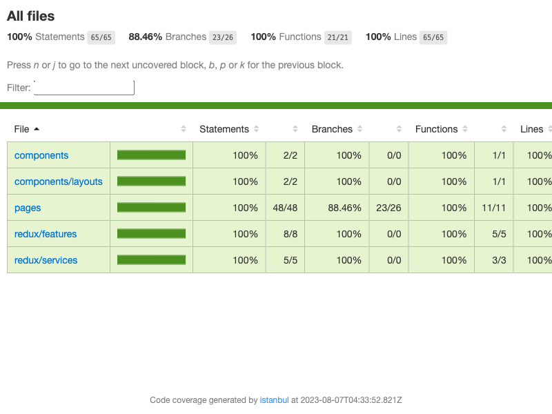

## Getting Started

First, install node packages:

```bash
npm install
```

After that, run the development server:

```bash
npm run dev
```

Open [http://localhost:3000](http://localhost:3000) with your browser to see the result.

You can start editing the page by modifying `src/pages/index.tsx`. The page auto-updates as you edit the file.

## Test Coverage

The following image gets updated automatically on every push to this branch, which means the coverage is up to date.


